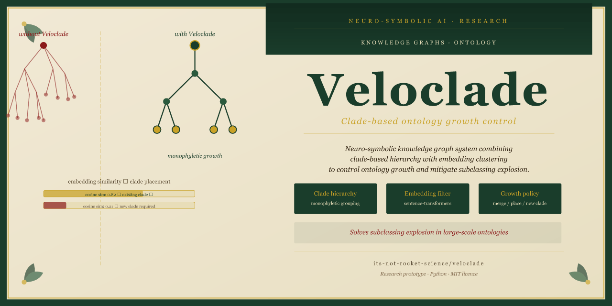

# Veloclade

[](https://python.org)
[](https://sbert.net)
[](LICENSE)

A neuro-symbolic knowledge graph system with clade-inspired hierarchy and embedding clustering to control ontology growth and mitigate **subclassing explosion**.

---

## The problem

In large ontologies, subclassing explosion is pervasive. Every time a new concept is added, the path of least resistance is to create a new subclass of something nearby. The result is ontologies thousands of nodes deep with near-duplicate classes, poor generalisation, and brittle inference. Existing approaches — OWL reasoners, manual curation — do not scale.

Veloclade approaches this differently: rather than preventing new nodes, it controls *where they go* by combining biological cladistics with semantic embedding clustering.

---

## How it works

```
New concept proposal
        │
        ▼
┌───────────────────────┐
│  Embedding encoder     │  sentence-transformers
└──────────┬────────────┘
           │
           ▼
┌───────────────────────┐
│  Clade membership      │  Find nearest existing clade
│  classifier            │  by embedding similarity
└──────────┬────────────┘
           │
           ▼
┌───────────────────────┐
│  Growth policy engine  │  Merge / place in clade / create new clade
│                        │  based on configurable thresholds
└──────────┬────────────┘
           │
           ▼
┌───────────────────────┐
│  Knowledge graph       │  RDFLib / custom graph store
│  update                │
└───────────────────────┘
```

Three outcomes are possible for any proposed concept:

| Decision | Condition | Effect |
|---|---|---|
| **Merge** | High similarity to existing node (> threshold) | Concept unified with existing node; no new node created |
| **Place** | Moderate similarity to a clade | Concept added within existing clade |
| **New clade** | Low similarity to all clades | New monophyletic clade created |

---

## Quick start

```bash
pip install -r requirements.txt
python -m veloclade.demo
```

This runs a demonstration of controlled ontology growth on a sample biological classification dataset, showing subclassing explosion in an unconstrained graph versus controlled growth under Veloclade's policy engine.

### Requirements

- Python 3.10+
- sentence-transformers
- RDFLib
- scikit-learn

---

## Related work

- Kulmanov et al. (2019) — [ELEmbeddings: Geometric construction of models for the Description Logic EL++](https://arxiv.org/abs/1902.10499)
- Chen et al. (2021) — [Ontology-Enhanced Pre-training for Bio-Medical NLP](https://arxiv.org/abs/2110.05572)

---

## Related projects

- [koios](https://github.com/its-not-rocket-science/koios) — ontology-grounded transformer for knowledge-augmented reasoning
- [kalmanorix](https://github.com/its-not-rocket-science/kalmanorix) — specialist embedding routing and retrieval evaluation
- [ananke](https://github.com/its-not-rocket-science/ananke) — ontology-driven world-building system (a practical application of controlled ontology growth)

---

## Status

Research prototype. Core clade membership classifier and growth policy engine are implemented. Evaluation against standard ontology benchmarks is planned.

---

## Licence

MIT
